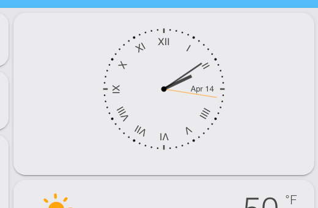

# analog-clock-card by [@aidanblack](https://www.github.com/aidanblack)
Home Assistant Lovelace Analog Clock Card

[![GitHub Release][releases-shield]][releases]
[![License][license-shield]](LICENSE)

![Project Maintenance][maintenance-shield]
[![GitHub Activity][commits-shield]][commits]

#### A simple SVG analog clock for Home Assistant

## Introduction
This is my first attempt at a custom card for the Home Assistant Lovelace UI. Apologies in advance if my implementation is imperfect or incomplete! It is a simple analog clock that uses SVG. The clock face uses roman numerals, since these are easier to rotate than standard numbers. The date is currently hard-coded with English abbreviations for the month.

Please feel free to implement any ideas or suggestions and issue a pull request. I can not guarantee that I will respond immediately, but I will consider all suggestions.

## HACS Installation (Recommended)
1. Under HACS -> Settings, add `https://github.com/aidanblack/analog-clock-card` as a custom repository
2. Search for 'analog clock card' under HACS -> Plugins
3. Install the plugin.
4. Add a new card to your Lovelace UI: `type: 'custom:analog-clock-card'`
5. That's it! There currently isn't anything to configure or any options.

## Manual Installation
1. Copy the `analog-clock-card.js` file to your `config/www` folder
2. Add a resource to your Lovelace configuration: `/local/analog-clock-card.js` (optionally increment a 'version' number to force the card to reload after an update)

3. Add a new card to your Lovelace UI: `type: 'custom:analog-clock-card'`
4. That's it! There currently isn't anything to configure or any options.
## Screenshots
Currently the clock uses colors from your theme:
#### Slate Theme

#### iOS Light Theme

#### iOS Dark theme plus background image

[commits-shield]: https://img.shields.io/github/commit-activity/y/aidanblack/analog-clock-card.svg?style=for-the-badge
[commits]: https://github.com/aidanblack/analog-clock-card/commits/master
[license-shield]: https://img.shields.io/github/license/aidanblack/analog-clock-card.svg?style=for-the-badge
[maintenance-shield]: https://img.shields.io/maintenance/yes/2020.svg?style=for-the-badge
[releases-shield]: https://img.shields.io/github/release/aidanblack/analog-clock-card.svg?style=for-the-badge
[releases]: https://github.com/aidanblack/analog-clock-card/releases